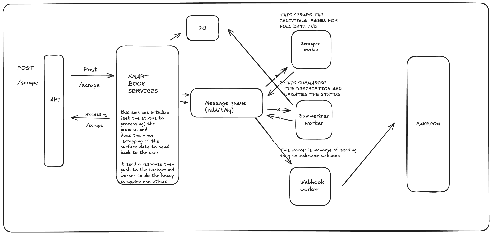
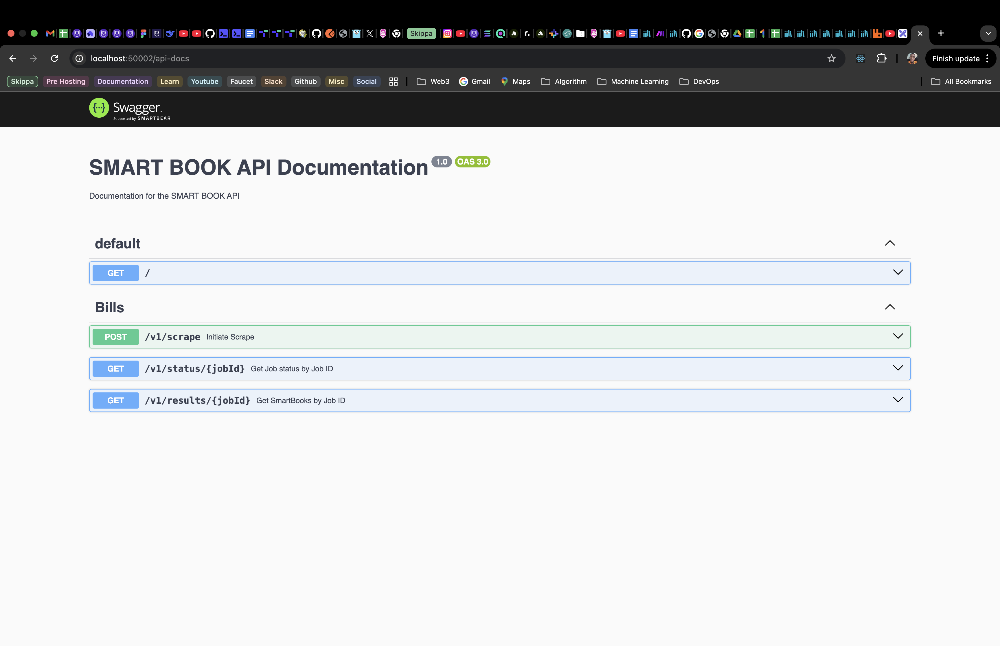
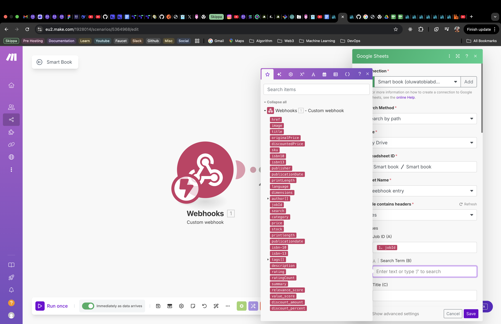
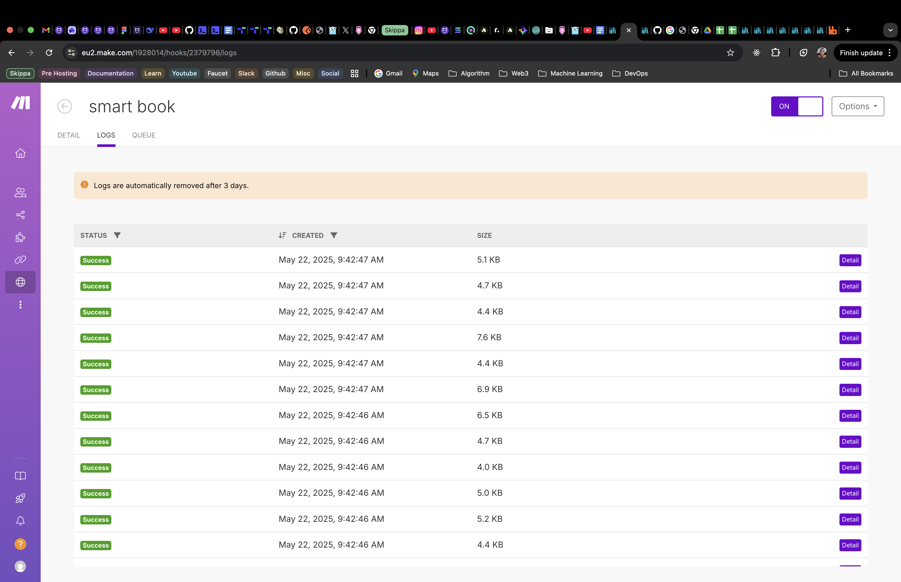
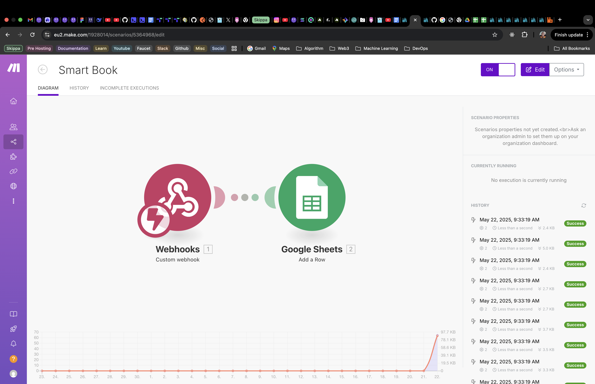
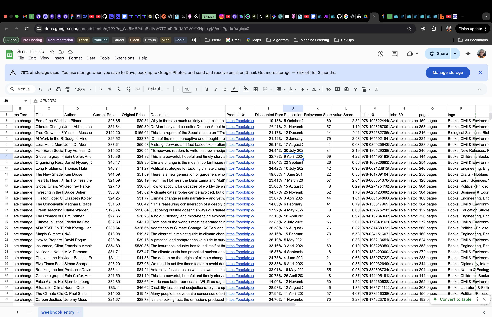

<p align="center">SMART BOOK API</p>
    <p align="center">
<a href="https://www.npmjs.com/~nestjscore" target="_blank"></a>
<a href="https://coveralls.io/github/nestjs/nest?branch=master" target="_blank"></a>
  <a href="https://twitter.com/nestframework" target="_blank"></a>
</p>

## Installation

## 📖 Overview

This project is a **TypeScript-based automation agent** built to demonstrate powerful integrations across web scraping, AI enrichment, data processing, and third-party workflow automation.

### 🔍 Core Capabilities

- **Dynamic Book Scraping:** Uses \***\*Puppeteer** to navigate and extract book data from\*_ **[BookDP.com.au](https://bookdp.com.au/), guided by user-defined thematic keywords (e.g.,** \*\* _"Australian history"_ ,\*\* \*\* _"sci-fi novels"\* ).
- **AI-Powered :** Enhances raw data using an **AI model** (such as OpenAI’s GPT) to generate insightful summaries, assess content relevance, and compute value scores.
- **Smart Cost Analysis:** Extracts pricing details and calculates discounts and value metrics to support better purchasing or cataloging decisions.
- **Workflow Automation:** Sends enriched, structured data to a **Make.com webhook** , enabling smooth integration with productivity platforms like **Google Sheets.**

## **Architecture**

<p align="center">
  
</p>

## **Stack**

- **Language:** NestJs, TypeScript, Node.js
- **Database :** RabbitMQ.
- **Asynchromous Task :** RabbitMQ.
- **Browser Manager:** Generic-pool: Help to manage spin up servers
- **Scraping:** Puppeteer: For crawling
- **LLM:** OpenAI API - For summarization and data enrichment
- **Automation:** Make.com

## **Swagger URL**

<p align="center">
  
</p>

## **Images**

<p align="center">
  
</p>
<p align="center">
  
</p>
<p align="center">
  
</p>
<p align="center">
  
</p>
<p align="center">
  
</p>
<p align="center">
  
</p>
<p align="center">
  
</p>
<p align="center">
  
</p>

## Running the app

```bash
# development - quick start with docker-compose
$ docker-compose -p smart_book up

# development
$ yarn run start

# watch mode
$ yarn run start:dev

# production mode
$ yarn run start:prod
```

```json

/scrape

{
    "status": "success",
    "status_code": 200,
    "message": "Scrape initiated successfully!",
    "timestamp": "2025-05-22T11:01:11.764Z",
    "data": {
        "job_id": "job_climate change_6yjwmc",
        "search": "climate change",
        "processed_data": 0,
        "total_expected_data": 32,
        "status": "processing",
        "id": "fa985cb1-076c-4ebf-95fc-7b24301cc2e3",
        "created_at": "2025-05-22T10:01:11.749Z",
        "updated_at": "2025-05-22T10:01:11.749Z",
        "rawScrapedData": [
            {
                "href": "https://bookdp.com.au/products/tree-growth-relation-climate-change-3725827850/",
                "image": "https://bookdp.com.au/wp-content/uploads/2025/04/41CqRFIsSOL._SY445_SX342_.jpg",
                "title": "Tree Growth in Relation to Climate Change",
                "originalPrice": "$155.01",
                "discountedPrice": "$122.20",
                "sku": "3725827850",
                "isbn10": "3725827850",
                "isbn13": "978-3725827855",
                "publisher": "MDPI AG",
                "publicationDate": "12 December 2024",
                "printLength": "216 pages",
                "language": "English",
                "dimensions": "16.99 x 1.75 x 24.41 cm"
            },
            {
                "href": "https://bookdp.com.au/products/organising-responses-climate-change-mitigation-1009266934/",
                "image": "https://bookdp.com.au/wp-content/uploads/2025/04/41yeTB3BzNL._SY445_SX342_.jpg",
                "title": "Organising Responses to Climate Change: The Politics of Mitigation, Adaptation and Suffering",
                "originalPrice": "$59.30",
                "discountedPrice": "$46.47",
                "sku": "1009266934",
                "isbn10": "1009266934",
                "isbn13": "978-1009266932",
                "publisher": null,
                "publicationDate": "22 September 2022",
                "printLength": "254 pages",
                "language": "English",
                "dimensions": "15.24 x 1.47 x 22.86 cm"
            },
            {
                "href": "https://bookdp.com.au/products/end-world-climate-change-anxieties-1923224441/",
                "image": "https://bookdp.com.au/wp-content/uploads/2025/04/41GVQcBUyEL._SY445_SX342_.jpg",
                "title": "End of the World, The: Climate Change and Its Anxieties",
                "originalPrice": "$29.51",
                "discountedPrice": "$23.85",
                "sku": "1923224441",
                "isbn10": "1923224441",
                "isbn13": "978-1923224445",
                "publisher": null,
                "publicationDate": "5 October 2024",
                "printLength": "150 pages",
                "language": "English",
                "dimensions": "15.24 x 0.76 x 22.86 cm"
            },
            {
                "href": "https://bookdp.com.au/products/false-alarm-climate-change-trillions-1541606388/",
                "image": "https://bookdp.com.au/wp-content/uploads/2025/04/41IGAHSYo9L._SY445_SX342_.jpg",
                "title": "False Alarm: How Climate Change Panic Costs Us Trillions, Hurts the Poor, and Fails to Fix the Planet",
                "originalPrice": "$38.65",
                "discountedPrice": "$32.89",
                "sku": "1541606388",
                "isbn10": "1541606388",
                "isbn13": "978-1541606388",
                "publisher": "Basic Books",
                "publicationDate": "12 November 2024",
                "printLength": "352 pages",
                "language": "English",
                "dimensions": "13.84 x 2.3 x 20.83 cm"
            },
            {
                "href": "https://bookdp.com.au/products/how-prepare-climate-change-practical-1982134518/",
                "image": "https://bookdp.com.au/wp-content/uploads/2025/04/41Kc0Td4aOL._SY445_SX342_.jpg",
                "title": "How to Prepare for Climate Change: A Practical Guide to Surviving the Chaos",
                "originalPrice": "$39.16",
                "discountedPrice": "$28.94",
                "sku": "1982134518",
                "isbn10": "1982134518",
                "isbn13": "978-1982134518",
                "publisher": "Simon & Schuster",
                "publicationDate": "5 May 2021",
                "printLength": "624 pages",
                "language": "English",
                "dimensions": "15.24 x 3.56 x 22.86 cm"
            },
            {
                "href": "https://bookdp.com.au/products/climate-change-facts-john-abbot-1923267094/",
                "image": "https://bookdp.com.au/wp-content/uploads/2025/04/418Cd8NlCJL._SY445_SX342_-300x427.jpg",
                "title": "Climate Change: The Facts 2025",
                "originalPrice": "$69.89",
                "discountedPrice": "$51.64",
                "sku": "1923267094",
                "isbn10": "1923267094",
                "isbn13": "978-1923267091",
                "publisher": "Australian Scholarly Publishing",
                "publicationDate": "21 November 2024",
                "printLength": "258 pages",
                "language": "English",
                "dimensions": "15.6 x 1.78 x 23.39 cm"
            },
            {
                "href": "https://bookdp.com.au/products/chaos-heavens-forgotten-history-climate-1839767227/",
                "image": "https://bookdp.com.au/wp-content/uploads/2025/04/41bcniVACFL._SY445_SX342_.jpg",
                "title": "Chaos in the Heavens: The Forgotten History of Climate Change",
                "originalPrice": "$41.36",
                "discountedPrice": "$31.11",
                "sku": "1839767227",
                "isbn10": "1839767227",
                "isbn13": "978-1839767227",
                "publisher": "Verso",
                "publicationDate": "4 June 2024",
                "printLength": "288 pages",
                "language": "English",
                "dimensions": "16.13 x 2.29 x 24.13 cm"
            },
            ...
        ]
    },
    "metadata": {}
}

/status/:jobId

{
    "status": "success",
    "status_code": 200,
    "message": "Bill retrieved successfully!",
    "timestamp": "2025-05-22T11:02:20.755Z",
    "data": {
        "id": "5f190758-2614-43af-9db0-ec24e840f537",
        "job_id": "job_climate change_fkcaar",
        "search": "climate change",
        "processed_data": "0",
        "total_expected_data": "32",
        "status": "completed",
        "created_at": "2025-05-22T06:30:48.153Z",
        "updated_at": "2025-05-22T06:31:43.202Z"
    },
    "metadata": {}
}

/results/:jobId

{
    "status": "success",
    "status_code": 200,
    "message": "SmartBooks retrieved successfully!",
    "timestamp": "2025-05-22T11:02:37.360Z",
    "data": [
        {
            "id": "3a640783-2520-4b6b-a4c0-f4446951b64b",
            "href": "https://bookdp.com.au/products/tree-growth-relation-climate-change-3725827850/",
            "image": "https://bookdp.com.au/wp-content/uploads/2025/04/41CqRFIsSOL._SY445_SX342_.jpg",
            "title": "Tree Growth in Relation to Climate Change",
            "originalPrice": "$155.01",
            "discountedPrice": "$122.20",
            "sku": "3725827850",
            "isbn10": "3725827850",
            "isbn13": "978-3725827855",
            "publisher": "MDPI AG",
            "publicationDate": "12 December 2024",
            "printLength": "216 pages",
            "language": "English",
            "dimensions": "16.99 x 1.75 x 24.41 cm",
            "author": [
                "Yassine Missaoud",
                "Jan Sviták",
                "Giorgio Alberti"
            ],
            "jobId": "job_climate change_fkcaar",
            "search": "climate change",
            "category": "Biology",
            "price": "$122.20",
            "stock": "Available in stock",
            "printlength": null,
            "publicationdate": null,
            "isbn_10": null,
            "isbn_13": null,
            "tags": [
                "Biological Sciences",
                "Biology",
                "Books",
                "Science - Nature & Maths"
            ],
            "description": "This is a reprint of the Special Issue on “”Tree Growth in Relation to Climate Change””, published in Forests . It includes the insights and research findings shared by worldwide leading experts in the field, from genetics, ecophysiological, and anatomical adaptations to dendrochronological features, explaining growth pattern associated with climate change. Through all these contributions, this SI will pave the way toward a better comprehension of how tree species response will be shaped in the future. —- ISBN: 9783725827855 | ISBN10: 3725827850 | ISBN-13: 978-3725827855",
            "rating": null,
            "ratingCount": null,
            "summary": "N/A",
            "relevance_score": 0,
            "discount_amount": null,
            "value_score": null,
            "discount_percent": null,
            "created_at": "2025-05-22T06:31:43.181Z",
            "updated_at": "2025-05-22T06:31:43.181Z"
        },
        {
            "id": "b08304e5-9112-4955-a7f7-1dea5c5eaf5b",
            "href": "https://bookdp.com.au/products/organising-responses-climate-change-mitigation-1009266934/",
            "image": "https://bookdp.com.au/wp-content/uploads/2025/04/41yeTB3BzNL._SY445_SX342_.jpg",
            "title": "Organising Responses to Climate Change: The Politics of Mitigation, Adaptation and Suffering",
            "originalPrice": "$59.30",
            "discountedPrice": "$46.47",
            "sku": "1009266934",
            "isbn10": "1009266934",
            "isbn13": "978-1009266932",
            "publisher": null,
            "publicationDate": "22 September 2022",
            "printLength": "254 pages",
            "language": "English",
            "dimensions": "15.24 x 1.47 x 22.86 cm",
            "author": [
                "Daniel Nyberg",
                "Christopher Wright",
                "Vanessa Bowden"
            ],
            "jobId": "job_climate change_fkcaar",
            "search": "climate change",
            "category": "Pollution",
            "price": "$46.47",
            "stock": "Available in stock",
            "printlength": null,
            "publicationdate": null,
            "isbn_10": null,
            "isbn_13": null,
            "tags": [
                "Books",
                "Civil & Environmental",
                "Engineering",
                "Engineering & Transportation",
                "Environmental",
                "Pollution"
            ],
            "description": "Climate change is the most important issue now facing humanity. As global temperatures increase, floods, fires and storms are becoming both more intense and frequent. People are suffering. And yet, emissions continue to rise. This book unpacks the activities of the key actors which have organised past and present climate responses – specifically, corporations, governments, and civil society organisations. Analysing three elements of climate change – mitigation, adaptation and suffering – the authors show how exponential growth of the capitalist system has allowed the fossil fuel industry to maintain its dominance. However, this hegemonic position is now coming under threat as new and innovative social movements have emerged, including the fossil fuel divestment movement, Fridays for Future, Extinction Rebellion and others. In exposing the inadequacies of current climate policies and pointing to the possibilities of new social and economic systems, this book highlights how the worst impacts of climate change can be avoided. —- ISBN: 9781009266932 | ISBN10: 1009266934 | ISBN-13: 978-1009266932",
            "rating": null,
            "ratingCount": null,
            "summary": "N/A",
            "relevance_score": 0,
            "discount_amount": null,
            "value_score": null,
            "discount_percent": null,
            "created_at": "2025-05-22T06:31:43.181Z",
            "updated_at": "2025-05-22T06:31:43.181Z"
        },
        {
            "id": "bc707e17-50a6-48aa-87c8-f1f7196e18e1",
            "href": "https://bookdp.com.au/products/end-world-climate-change-anxieties-1923224441/",
            "image": "https://bookdp.com.au/wp-content/uploads/2025/04/41GVQcBUyEL._SY445_SX342_.jpg",
            "title": "End of the World, The: Climate Change and Its Anxieties",
            "originalPrice": "$29.51",
            "discountedPrice": "$23.85",
            "sku": "1923224441",
            "isbn10": "1923224441",
            "isbn13": "978-1923224445",
            "publisher": null,
            "publicationDate": "5 October 2024",
            "printLength": "150 pages",
            "language": "English",
            "dimensions": "15.24 x 0.76 x 22.86 cm",
            "author": [
                "Ian Plimer"
            ],
            "jobId": "job_climate change_fkcaar",
            "search": "climate change",
            "category": "Pollution",
            "price": "$23.85",
            "stock": "Available in stock",
            "printlength": null,
            "publicationdate": null,
            "isbn_10": null,
            "isbn_13": null,
            "tags": [
                "Books",
                "Civil & Environmental",
                "Engineering",
                "Engineering & Transportation",
                "Environmental",
                "Pollution"
            ],
            "description": "Why is there so much anxiety about climate change? Is the world really coming to an end? Should young people be afraid? In an era of remarkable human achievement, this book challenges the prevailing narrative of doom surrounding climate change. It argues that while young people in the West grapple with anxiety, many others around the globe face far more pressing concerns. This provocative exploration shows how wealth, innovation, and resilience have historically led to human flourishing, even amidst environmental changes. The book dismantles myths of impending catastrophe and advocates for a rational approach to adaptation instead of fear-driven policies. —- ISBN: 9781923224445 | ISBN10: 1923224441 | ISBN-13: 978-1923224445",
            "rating": null,
            "ratingCount": null,
            "summary": "N/A",
            "relevance_score": 0,
            "discount_amount": null,
            "value_score": null,
            "discount_percent": null,
            "created_at": "2025-05-22T06:31:43.181Z",
            "updated_at": "2025-05-22T06:31:43.181Z"
        },
        {
            "id": "1a7cc9f2-fab9-4f74-8ab5-7c7fa3a5c26b",
            "href": "https://bookdp.com.au/products/false-alarm-climate-change-trillions-1541606388/",
            "image": "https://bookdp.com.au/wp-content/uploads/2025/04/41IGAHSYo9L._SY445_SX342_.jpg",
            "title": "False Alarm: How Climate Change Panic Costs Us Trillions, Hurts the Poor, and Fails to Fix the Planet",
            "originalPrice": "$38.65",
            "discountedPrice": "$32.89",
            "sku": "1541606388",
            "isbn10": "1541606388",
            "isbn13": "978-1541606388",
            "publisher": "Basic Books",
            "publicationDate": "12 November 2024",
            "printLength": "352 pages",
            "language": "English",
            "dimensions": "13.84 x 2.3 x 20.83 cm",
            "author": [
                "Bjorn Lomborg"
            ],
            "jobId": "job_climate change_fkcaar",
            "search": "climate change",
            "category": "Pollution",
            "price": "$32.89",
            "stock": "Available in stock",
            "printlength": null,
            "publicationdate": null,
            "isbn_10": null,
            "isbn_13": null,
            "tags": [
                "Books",
                "Civil & Environmental",
                "Engineering",
                "Engineering & Transportation",
                "Environmental",
                "Pollution"
            ],
            "description": "Hurricanes batter our coasts. Wildfires rage across the American West. Glaciers collapse in the Artic. Politicians, activists, and the media espouse a common message: climate change is destroying the planet, and we must take drastic action immediately to stop it. Children panic about their future, and adults wonder if it is even ethical to bring new life into the world. Enough, argues bestselling author Bjorn Lomborg. Climate change is real, but it’s not the apocalyptic threat that we’ve been told it is. Projections of Earth’s imminent demise are based on bad science and even worse economics. In panic, world leaders have committed to wildly expensive but largely ineffective policies that hamper growth and crowd out more pressing investments in human capital, from immunization to education. False Alarm will convince you that everything you think about climate change is wrong — and points the way toward making the world a vastly better, if slightly warmer, place for us all. —- ISBN: 9781541606388 | ISBN10: 1541606388 | ISBN-13: 978-1541606388",
            "rating": null,
            "ratingCount": null,
            "summary": "N/A",
            "relevance_score": 0,
            "discount_amount": null,
            "value_score": null,
            "discount_percent": null,
            "created_at": "2025-05-22T06:31:43.181Z",
            "updated_at": "2025-05-22T06:31:43.181Z"
        },
        {
            "id": "6df0d999-36b8-4ef6-a404-b89409dcbcc4",
            "href": "https://bookdp.com.au/products/how-prepare-climate-change-practical-1982134518/",
            "image": "https://bookdp.com.au/wp-content/uploads/2025/04/41Kc0Td4aOL._SY445_SX342_.jpg",
            "title": "How to Prepare for Climate Change: A Practical Guide to Surviving the Chaos",
            "originalPrice": "$39.16",
            "discountedPrice": "$28.94",
            "sku": "1982134518",
            "isbn10": "1982134518",
            "isbn13": "978-1982134518",
            "publisher": "Simon & Schuster",
            "publicationDate": "5 May 2021",
            "printLength": "624 pages",
            "language": "English",
            "dimensions": "15.24 x 3.56 x 22.86 cm",
            "author": [
                "David Pogue"
            ],
            "jobId": "job_climate change_fkcaar",
            "search": "climate change",
            "category": "Pollution",
            "price": "$28.94",
            "stock": "Available in stock",
            "printlength": null,
            "publicationdate": null,
            "isbn_10": null,
            "isbn_13": null,
            "tags": [
                "Books",
                "Civil & Environmental",
                "Engineering",
                "Engineering & Transportation",
                "Environmental",
                "Pollution"
            ],
            "description": "A practical and comprehensive guide to surviving the greatest disaster of our time, from New York Times bestselling self-help author and beloved CBS Sunday Morning science and technology correspondent David Pogue. You might not realize it, but we’re already living through the beginnings of climate chaos. In Arizona, laborers now start their day at 3 a.m. because it’s too hot to work past noon. Chinese investors are snapping up real estate in Canada. Millennials have evacuation plans. Moguls are building bunkers. Retirees in Miami are moving inland. In How to Prepare for Climate Change, bestselling self-help author David Pogue offers sensible, deeply researched advice for how the rest of us should start to ready ourselves for the years ahead. Pogue walks readers through what to grow, what to eat, how to build, how to insure, where to invest, how to prepare your children and pets, and even where to consider relocating when the time comes. (Two areas of the country, in particular, have the requisite cool temperatures, good hospitals, reliable access to water, and resilient infrastructure to serve as climate havens in the years ahead.) He also provides wise tips for managing your anxiety, as well as action plans for riding out every climate catastrophe, from superstorms and wildfires to ticks and epidemics. Timely and enlightening, How to Prepare for Climate Change is an indispensable guide for anyone who read The Uninhabitable Earth or The Sixth Extinction and wants to know how to make smart choices for the upheaval ahead. —- ISBN: 9781982134518 | ISBN10: 1982134518 | ISBN-13: 978-1982134518",
            "rating": null,
            "ratingCount": null,
            "summary": "N/A",
            "relevance_score": 0,
            "discount_amount": null,
            "value_score": null,
            "discount_percent": null,
            "created_at": "2025-05-22T06:31:43.181Z",
            "updated_at": "2025-05-22T06:31:43.181Z"
        },
        {
            "id": "8c3ae622-0bfb-44c2-9a19-e64a86b2a4db",
            "href": "https://bookdp.com.au/products/climate-change-facts-john-abbot-1923267094/",
            "image": "https://bookdp.com.au/wp-content/uploads/2025/04/418Cd8NlCJL._SY445_SX342_-300x427.jpg",
            "title": "Climate Change: The Facts 2025",
            "originalPrice": "$69.89",
            "discountedPrice": "$51.64",
            "sku": "1923267094",
            "isbn10": "1923267094",
            "isbn13": "978-1923267091",
            "publisher": "Australian Scholarly Publishing",
            "publicationDate": "21 November 2024",
            "printLength": "258 pages",
            "language": "English",
            "dimensions": "15.6 x 1.78 x 23.39 cm",
            "author": [
                "John Abbot",
                "Jennifer Marohasy"
            ],
    ]
    "metadata": {}
}

```

#### \*\*✅ Documentation http://localhost:50002/api-docs

Nest is [MIT licensed](LICENSE).
