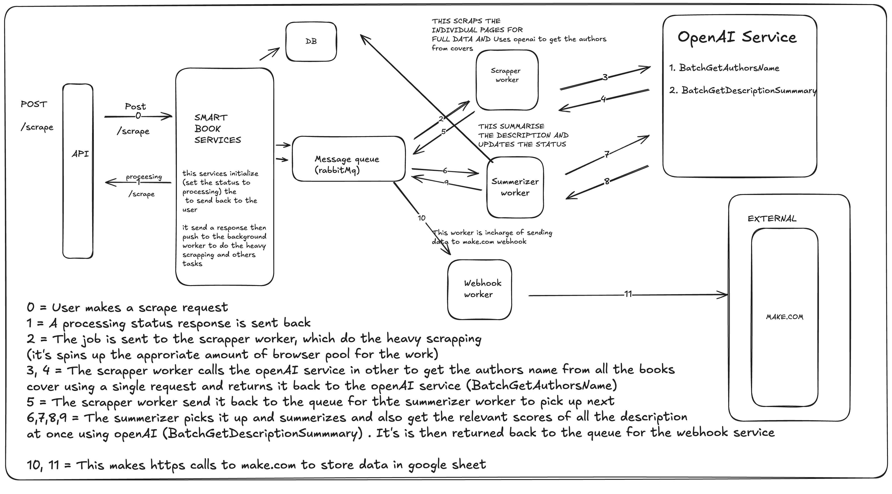
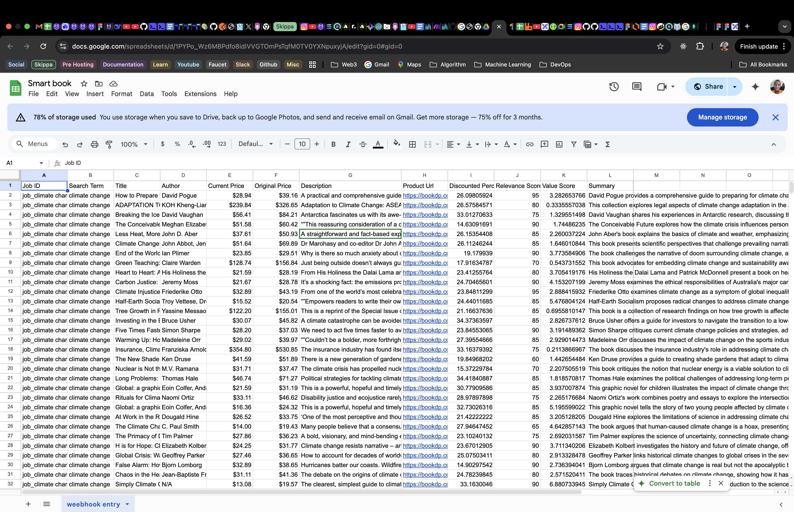
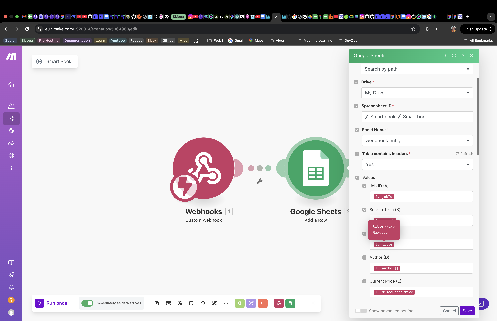

<p align="center">SMART BOOK API</p>
    <p align="center">
<a href="https://www.npmjs.com/~nestjscore" target="_blank"></a>
<a href="https://coveralls.io/github/nestjs/nest?branch=master" target="_blank"></a>
  <a href="https://twitter.com/nestframework" target="_blank"></a>
</p>

## Installation

## 📖 Overview

This project is a **TypeScript-based automation agent** built to demonstrate powerful integrations across web scraping, AI enrichment, data processing, and third-party workflow automation.

### 🔍 Core Capabilities

- **Dynamic Book Scraping:** Uses \***\*Puppeteer** to navigate and extract book data from\*_ **[BookDP.com.au](https://bookdp.com.au/), guided by user-defined thematic keywords (e.g.,** \*\* _"Australian history"_ ,\*\* \*\* _"sci-fi novels"\* ).
- **AI-Powered :** Enhances raw data using an **AI model** (such as OpenAI’s GPT) to generate insightful summaries, assess content relevance, and compute value scores.
- **Smart Cost Analysis:** Extracts pricing details and calculates discounts and value metrics to support better purchasing or cataloging decisions.
- **Workflow Automation:** Sends enriched, structured data to a **Make.com webhook** , enabling smooth integration with productivity platforms like **Google Sheets.**

## **Architectural Diagram**

<p align="center">
  
</p>

## **Stack**

- **Language:** TypeScript (NestJS, Node.js)
- **Database:** PostgreSQL (TypeORM)
- **Asynchronous Tasks:** RabbitMQ
- **Browser Management:** generic-pool (for managing browser instances)
- **Web Scraping:** Puppeteer
- **LLM Integration:** OpenAI API (for summarization and enrichment)
- **Workflow Automation:** Make.com

## Requirements

- **Node.js** v18 or higher
- **Yarn** (or npm)
- **Docker** and **docker-compose** (for containerized development)
- **PostgreSQL** (if running locally, otherwise use Docker)
- **OpenAI API Key** (for AI enrichment features)
- **Make.com account** (for workflow automation integration)
- **RabbitMQ** (if running locally, otherwise use Docker)
- **Git** (for version control)
- **Puppeteer** dependencies (ensure required system libraries are installed for headless Chrome)

## Usage

### 1. Clone the repository

```bash
git clone https://github.com/abdulazeez001/smart-book-backend.git
cd smart-book-backend
```

### 2. Configure environment variables

Copy `.env.example` to `.env` and fill in the required values (database, OpenAI API key, etc.).

### 3. Install dependencies

```bash
yarn install
# or
npm install
```

### 4. Start services

- To run services individually (PostgreSQL, RabbitMQ, etc.) and start the app:

  ```bash
  yarn start:dev
  ```

- Or local development, use Docker Compose:
  ```bash
  docker-compose up
  ```

### 5. Access API

- API base URL: `http://localhost:50002`
- Swagger docs: `http://localhost:50002/api-docs`

### 6. Example API Endpoints

- `POST /scrape` — Initiate a new book scraping job.
- `GET /status/:jobId` — Check the status of a scraping job.
- `GET /results/:jobId` — Retrieve processed book data for a job.

For more details, see the Swagger documentation.

## **Swagger Documentation URL**

<p align="center">
  
</p>

## **Images**

<p align="center">
  
</p>

<p align="center">
  
</p>
<p align="center">
  
</p>
<p align="center">
  
</p>
<p align="center">
  
</p>
<p align="center">
  
</p>
<p align="center">
  
</p>
<p align="center">
  
</p>
<p align="center">
  
</p>

### 📦 Example API Responses

Below are sample JSON responses for the main API endpoints:

#### `POST /scrape`

```json
{
  "status": "success",
  "status_code": 200,
  "message": "Scrape initiated successfully!",
  "timestamp": "2025-05-26T03:01:56.524Z",
  "data": {
    "job_id": "job_climate change_zvxu4z",
    "search": "climate change",
    "processed_data": 0,
    "total_expected_data": 0,
    "status": "processing",
    "id": "d36f9b8e-b823-4da5-b511-bcc966ce39e1",
    "created_at": "2025-05-26T02:01:56.514Z",
    "updated_at": "2025-05-26T02:01:56.514Z"
  },
  "metadata": {}
}
```

#### `GET /status/:jobId`

```json
{
  "status": "success",
  "status_code": 200,
  "message": "Process retrieved successfully!",
  "timestamp": "2025-05-26T03:19:49.640Z",
  "data": {
    "id": "3e32cfef-3ade-4284-b1e6-1c90fe9f18c4",
    "job_id": "job_climate change_xh67bb",
    "search": "climate change",
    "processed_data": "32",
    "total_expected_data": "32",
    "status": "completed",
    "created_at": "2025-05-26T01:56:20.102Z",
    "updated_at": "2025-05-26T01:57:20.314Z"
  },
  "metadata": {}
}
```

#### `GET /results/:jobId`

```json
{
  "status": "success",
  "status_code": 200,
  "message": "SmartBooks retrieved successfully!",
  "timestamp": "2025-05-26T03:20:37.254Z",
  "data": [
    {
      "id": "e8b8c1e0-c59e-405d-a8dd-3b0f85f68ea0",
      "href": "https://bookdp.com.au/products/organising-responses-climate-change-mitigation-1009266934/",
      "image": "https://bookdp.com.au/wp-content/uploads/2025/04/41yeTB3BzNL._SY445_SX342_.jpg",
      "title": "Organising Responses to Climate Change: The Politics of Mitigation, Adaptation and Suffering",
      "originalPrice": "$59.30",
      "discountedPrice": "$46.47",
      "author": ["Daniel Nyberg", "Christopher Wright", "Vanessa Bowden"],
      "jobId": "job_climate change_xh67bb",
      "search": "climate change",
      "description": "Climate change is the most important issue now facing humanity. ...",
      "summary": "This book explores the role of corporations, governments, and social movements in addressing climate change, focusing on mitigation, adaptation, and the systemic issues enabling fossil fuel dominance.",
      "relevance_score": 95,
      "discount_amount": 12.83,
      "value_score": 2.04,
      "discount_percent": 21.64,
      "created_at": "2025-05-26T01:57:20.287Z",
      "updated_at": "2025-05-26T01:57:20.287Z"
    },
    {
      "id": "bbac5219-0d69-4a43-bfd7-72e71550fed0",
      "href": "https://bookdp.com.au/products/climate-injustice-global-inequality-combat-1778401627/",
      "image": "https://bookdp.com.au/wp-content/uploads/2025/04/41AqGN0-IaL._SY445_SX342_.jpg",
      "title": "Climate Injustice: Why We Need to Fight Global Inequality to Combat Climate Change",
      "originalPrice": "$43.19",
      "discountedPrice": "$32.89",
      "author": ["Friederike Otto"],
      "jobId": "job_climate change_xh67bb",
      "search": "climate change",
      "description": "From one of the world’s most celebrated thinkers on climate change comes a groundbreaking investigation into extreme weather ...",
      "summary": "Friederike Otto examines climate change as a symptom of global inequality, using extreme weather events to highlight the failures of political and social infrastructures worldwide.",
      "relevance_score": 95,
      "discount_amount": 10.3,
      "value_score": 2.89,
      "discount_percent": 23.85,
      "created_at": "2025-05-26T01:57:20.287Z",
      "updated_at": "2025-05-26T01:57:20.287Z"
    },
    {
      "id": "0b71351d-42eb-45e0-824a-63e7be22b9da",
      "href": "https://bookdp.com.au/products/how-prepare-climate-change-practical-1982134518/",
      "image": "https://bookdp.com.au/wp-content/uploads/2025/04/41Kc0Td4aOL._SY445_SX342_.jpg",
      "title": "How to Prepare for Climate Change: A Practical Guide to Surviving the Chaos",
      "originalPrice": "$39.16",
      "discountedPrice": "$28.94",
      "author": ["David Pogue"],
      "jobId": "job_climate change_xh67bb",
      "search": "climate change",
      "description": "A practical and comprehensive guide to surviving the greatest disaster of our time ...",
      "summary": "David Pogue provides a comprehensive guide to preparing for climate change, offering practical advice on lifestyle changes and anxiety management for a future affected by climate chaos.",
      "relevance_score": 95,
      "discount_amount": 10.22,
      "value_score": 3.28,
      "discount_percent": 26.1,
      "created_at": "2025-05-26T01:57:20.287Z",
      "updated_at": "2025-05-26T01:57:20.287Z"
    }
    // ...more results
  ],
  "metadata": {}
}
```

> **Note:** The above responses are examples. Field values may vary depending on your search and processing results.

#### \*\*✅ Documentation http://localhost:50002/api-docs

Nest is [MIT licensed](LICENSE).
