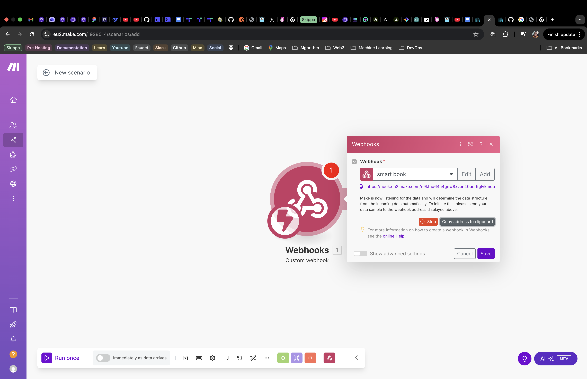

<p align="center">SMART BOOK API</p>
    <p align="center">
<a href="https://www.npmjs.com/~nestjscore" target="_blank"></a>
<a href="https://coveralls.io/github/nestjs/nest?branch=master" target="_blank"></a>
  <a href="https://twitter.com/nestframework" target="_blank"></a>
</p>

## Installation

## 📖 Overview

This project is a **TypeScript-based automation agent** built to demonstrate powerful integrations across web scraping, AI enrichment, data processing, and third-party workflow automation.

### 🔍 Core Capabilities

- **Dynamic Book Scraping:** Uses \***\*Puppeteer** to navigate and extract book data from\*_ **[BookDP.com.au](https://bookdp.com.au/), guided by user-defined thematic keywords (e.g.,** \*\* _"Australian history"_ ,\*\* \*\* _"sci-fi novels"\* ).
- **AI-Powered :** Enhances raw data using an **AI model** (such as OpenAI’s GPT) to generate insightful summaries, assess content relevance, and compute value scores.
- **Smart Cost Analysis:** Extracts pricing details and calculates discounts and value metrics to support better purchasing or cataloging decisions.
- **Workflow Automation:** Sends enriched, structured data to a **Make.com webhook** , enabling smooth integration with productivity platforms like **Google Sheets.**

## **Architecture**

<p align="center">
  
</p>

## **Images**

<p align="center">
  
</p>
<p align="center">
  
</p>
<p align="center">
  
</p>
<p align="center">
  
</p>
<p align="center">
  
</p>
<p align="center">
  
</p>
<p align="center">
  
</p>
<p align="center">
  
</p>

## Running the app

```bash
# development - quick start with docker-compose
$ docker-compose -p smart_book up

# development
$ yarn run start

# watch mode
$ yarn run start:dev

# production mode
$ yarn run start:prod
```

Stack

- **Language:** TypeScript, Node.js
- **Database :** RabbitMQ.
- **Asynchromous Task :** RabbitMQ.
- **Browser Manager:** Generic-pool: Help to manage spin up servers
- **Scraping:** Puppeteer: For crawling
- **LLM:** OpenAI API - For summarization and data enrichment
- **Automation:** Make.com

#### \*\*✅ Documentation http://localhost:50002/api-docs

Nest is [MIT licensed](LICENSE).
